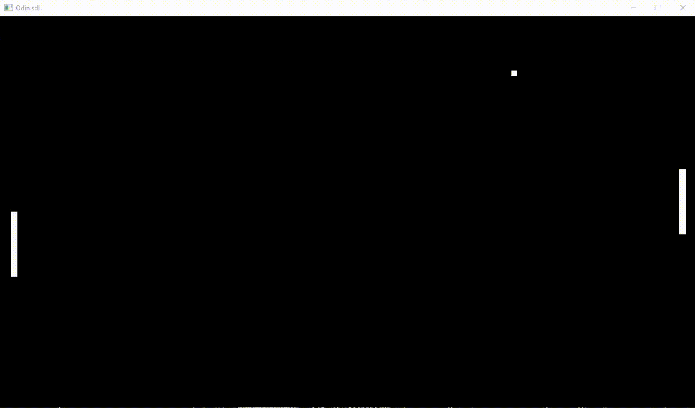

# Pong Game in Odin Programming Language



## Description

This repository contains a simple implementation of the classic Pong game using the Odin programming language.

## Features

- Player vs simple AI Pong game.
- Player 1 controls: W (Up), S (Down).

## Getting Started

### Prerequisites

Make sure you have Odin installed on your machine. You can find the Odin programming language at [odin-lang.org](https://odin-lang.org/).

### Installation

1. Clone the repository:

   ```bash
   git clone https://github.com/your-username/pong-odin.git

2. Build:

   ```bash
   odin build .

3. Run .exe file
